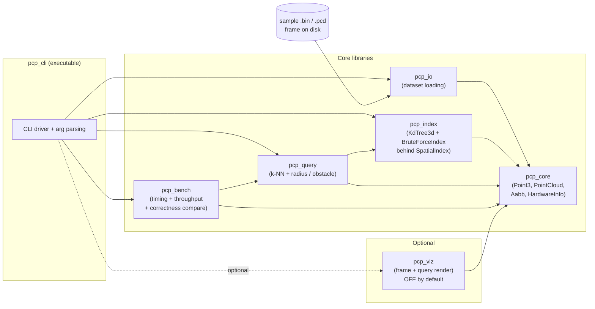
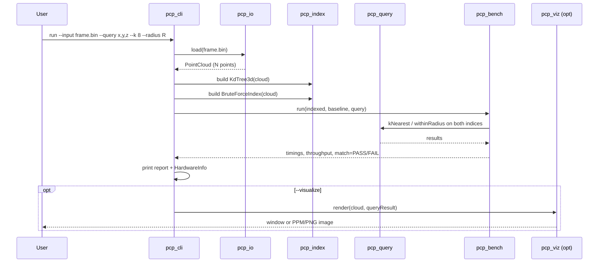

# Design Document Specification — PointCloudPipeline

- **Project:** PointCloudPipeline
- **Stage:** System / Software Design
- **Status:** Draft for C++ Developer hand-off
- **Source SRS:** [docs/requirements/point-cloud-pipeline-srs.md](../requirements/point-cloud-pipeline-srs.md)
- **Date:** 2026-09-12

---

## 1. Architecture Overview

PointCloudPipeline is a single-process, single-frame CPU pipeline. Data flows in
one direction — load → index → query → benchmark → (optional) visualize — driven
by a thin CLI application. The design isolates each concern into its own static
library target so that each stage is independently unit-testable and the heavy,
optional visualization dependency never contaminates the core pipeline.

### 1.1 Guiding principles

- **Separation of concerns:** each stage (IO, index, query, bench, viz) is a
  library with a narrow public header; the CLI wires them together.
- **Dependency inversion at boundaries:** `query` depends on a `SpatialIndex`
  interface, not on a concrete tree. The brute-force baseline and the k-d tree
  both implement that interface, which is what makes the FR-6/FR-7 correctness
  comparison trivial and mock-free.
- **Value semantics for data, `unique_ptr` for tree nodes:** the point cloud is a
  contiguous `std::vector` (cache-friendly at 1M points); tree ownership stays
  with `std::unique_ptr` node chains as upstream already does.
- **Optional heavy deps are decoupled targets:** `viz` (and its Open3D-or-not
  decision) is a separate target guarded by a CMake option; the core builds and
  the benchmark runs with `viz` switched off.

### 1.2 Component diagram



### 1.3 Data-flow sequence



---

## 2. Module Breakdown

| Target | Kind | Responsibility | Depends on (internal) | Third-party |
|---|---|---|---|---|
| `pcp_core` | static lib | Fundamental value types: `Point3`, `PointCloud`, `Aabb`, `HardwareInfo`, distance helpers, `Scalar` alias | — | spdlog (PRIVATE, optional) |
| `pcp_io` | static lib | Load a frame from disk into a `PointCloud` (KITTI `.bin` + `.pcd`/`.ply` ASCII) | `pcp_core` | — |
| `pcp_index` | static lib | `SpatialIndex` interface + `KdTree3d` (adapted upstream) + `BruteForceIndex` baseline | `pcp_core` | — |
| `pcp_query` | static lib | Query algorithms (k-NN, radius/obstacle) expressed against `SpatialIndex` | `pcp_core`, `pcp_index` | — |
| `pcp_bench` | static lib | Timing, throughput, correctness comparison harness | `pcp_core`, `pcp_query` | spdlog (PRIVATE, optional) |
| `pcp_viz` | static lib (optional) | Render a frame + query result; behind `PCP_ENABLE_VIZ` | `pcp_core` | Open3D **or** none (see §7 OQ-4) |
| `pcp_cli` | executable | Arg parsing, wiring, reporting (FR-9/FR-10) | all of the above | — |
| `pcp_tests` | test exe | Unit tests + correctness + micro-bench sanity | all of the above | GoogleTest |

Rationale for many small libraries over one blob: it enforces the dependency
direction (`query` may see `index`, but `index` must never see `query`), keeps
compile units small, and lets the test target link only what each test needs.

---

## 3. Key Interfaces

All headers live under `include/pcp/<module>/`. Signatures below are
headers-level pseudocode — enough to implement without redesigning. Namespace is
`pcp`.

### 3.1 `pcp_core`

```cpp
// include/pcp/core/types.hpp
namespace pcp {

using Scalar = float;                 // OQ-5: float chosen; see §7

struct Point3 {
    Scalar x{}, y{}, z{};
    // Dimension accessor kept compatible with the upstream k-d tree style,
    // extended from 2 -> 3 dimensions.
    Scalar operator[](std::size_t dim) const;   // dim % 3 -> x/y/z
};

[[nodiscard]] Scalar squaredDistance(const Point3& a, const Point3& b) noexcept;
[[nodiscard]] Scalar distance(const Point3& a, const Point3& b) noexcept;

// Contiguous, cache-friendly storage for 1M+ points (NFR-1).
class PointCloud {
public:
    PointCloud() = default;
    explicit PointCloud(std::vector<Point3> pts);

    [[nodiscard]] std::size_t size() const noexcept;
    [[nodiscard]] bool empty() const noexcept;
    [[nodiscard]] const Point3& operator[](std::size_t i) const;
    [[nodiscard]] const std::vector<Point3>& points() const noexcept;

    void reserve(std::size_t n);
    void push_back(const Point3& p);
private:
    std::vector<Point3> mPoints;
};

// Axis-aligned bounding box; the 3D generalization of the upstream Rectangle.
struct Aabb {
    Point3 min{};
    Point3 max{};
    [[nodiscard]] bool contains(const Point3& p) const noexcept;
    [[nodiscard]] Scalar min(std::size_t dim) const noexcept;
    [[nodiscard]] Scalar max(std::size_t dim) const noexcept;
    [[nodiscard]] static Aabb around(const Point3& c, Scalar radius) noexcept;
};

} // namespace pcp
```

```cpp
// include/pcp/core/hardware_info.hpp  (FR-10 / NFR-4)
namespace pcp {
struct HardwareInfo {
    std::string cpuModel;       // parsed from /proc/cpuinfo (Linux-first, NFR-2)
    std::uint64_t totalRamBytes{};
    unsigned hardwareThreads{};
    std::string compiler;       // e.g. "GCC 13.2" captured at build time
    std::string buildType;      // e.g. "Release"
};
[[nodiscard]] HardwareInfo queryHardwareInfo();
std::ostream& operator<<(std::ostream&, const HardwareInfo&);
} // namespace pcp
```

### 3.2 `pcp_io`

```cpp
// include/pcp/io/loader.hpp  (FR-1, FR-2)
namespace pcp::io {

enum class Format { Auto, KittiBin, Pcd, Ply };

struct LoadResult {
    PointCloud cloud;
    std::size_t pointCount{};   // reported to satisfy FR-1 acceptance
    Format detectedFormat{};
};

// Throws std::runtime_error on unreadable / malformed input (system boundary).
[[nodiscard]] LoadResult load(const std::filesystem::path& file,
                              Format fmt = Format::Auto);

} // namespace pcp::io
```

KITTI `.bin` layout: little-endian `float32` quadruples `[x, y, z, reflectance]`;
the loader reads x/y/z and discards reflectance. ASCII `.pcd`/`.ply` supported for
the smaller visualization frame. Format auto-detection is by extension.

### 3.3 `pcp_index`

```cpp
// include/pcp/index/spatial_index.hpp   (the dependency-inversion seam)
namespace pcp {

struct Neighbor {
    std::size_t index{};        // index into the source PointCloud
    Scalar squaredDist{};
};

class SpatialIndex {
public:
    virtual ~SpatialIndex() = default;

    // FR-4: k nearest neighbors, sorted ascending by distance.
    [[nodiscard]] virtual std::vector<Neighbor>
        kNearest(const Point3& query, std::size_t k) const = 0;

    // FR-5: all points within radius (obstacle-avoidance primitive).
    [[nodiscard]] virtual std::vector<Neighbor>
        withinRadius(const Point3& query, Scalar radius) const = 0;

    [[nodiscard]] virtual std::string name() const = 0;
};

} // namespace pcp
```

```cpp
// include/pcp/index/kd_tree_3d.hpp   (adapted & extended upstream KDTree)
namespace pcp {

class KdTree3d final : public SpatialIndex {
public:
    // Bulk build via median split for a balanced tree at 1M points.
    // (Upstream inserts one-by-one and can degrade to O(N) depth; bulk-build
    //  is new work justified in §6.)
    explicit KdTree3d(const PointCloud& cloud);

    [[nodiscard]] std::vector<Neighbor>
        kNearest(const Point3& query, std::size_t k) const override;   // NEW (OQ-2)
    [[nodiscard]] std::vector<Neighbor>
        withinRadius(const Point3& query, Scalar radius) const override;
    [[nodiscard]] std::string name() const override; // "KdTree3d"

    [[nodiscard]] int depth() const noexcept;
private:
    struct Node { std::size_t point; std::unique_ptr<Node> left, right; };
    std::unique_ptr<Node> mRoot;
    const PointCloud* mCloud;   // non-owning; cloud outlives the index
};

} // namespace pcp
```

```cpp
// include/pcp/index/brute_force_index.hpp   (FR-6 baseline)
namespace pcp {
class BruteForceIndex final : public SpatialIndex {
public:
    explicit BruteForceIndex(const PointCloud& cloud);
    [[nodiscard]] std::vector<Neighbor>
        kNearest(const Point3& q, std::size_t k) const override;      // linear scan
    [[nodiscard]] std::vector<Neighbor>
        withinRadius(const Point3& q, Scalar r) const override;       // linear scan
    [[nodiscard]] std::string name() const override; // "BruteForce"
private:
    const PointCloud* mCloud;
};
} // namespace pcp
```

### 3.4 `pcp_query`

The query layer is deliberately thin — it adds problem-level semantics on top of
the generic index primitives and is written once against `SpatialIndex`, so it
runs unchanged over both the k-d tree and the brute-force baseline.

```cpp
// include/pcp/query/queries.hpp   (FR-4, FR-5)
namespace pcp::query {

struct NearestResult {
    std::vector<Neighbor> neighbors;  // k results, sorted
};

[[nodiscard]] NearestResult
nearestNeighbors(const SpatialIndex& idx, const Point3& q, std::size_t k);

struct ObstacleResult {
    bool obstaclePresent{};           // any point within radius?
    std::vector<Neighbor> points;     // the offending points
};

// Obstacle-avoidance: is anything within `radius` of the probe location?
[[nodiscard]] ObstacleResult
obstaclesWithin(const SpatialIndex& idx, const Point3& probe, Scalar radius);

} // namespace pcp::query
```

### 3.5 `pcp_bench`

```cpp
// include/pcp/bench/harness.hpp   (FR-7, FR-9, NFR-5)
namespace pcp::bench {

struct Timing { std::string label; double microseconds{}; };

struct ComparisonReport {
    Timing indexBuild;
    Timing indexedQuery;
    Timing baselineQuery;
    double speedup{};              // baseline / indexed
    double throughputPointsPerSec{}; // FR-9
    bool resultsMatch{};           // NFR-5, within tolerance
    std::size_t pointCount{};
};

// Runs the same query on both indices and compares within `tolerance`.
[[nodiscard]] ComparisonReport
compareKNearest(const SpatialIndex& indexed, const SpatialIndex& baseline,
                const PointCloud& cloud, const Point3& query,
                std::size_t k, Scalar tolerance);

[[nodiscard]] ComparisonReport
compareRadius(const SpatialIndex& indexed, const SpatialIndex& baseline,
              const PointCloud& cloud, const Point3& query,
              Scalar radius, Scalar tolerance);

std::ostream& operator<<(std::ostream&, const ComparisonReport&);

// Thin RAII timer, generalized from the upstream `TimeBench`.
class ScopedTimer {
public:
    explicit ScopedTimer(Timing& out);
    ~ScopedTimer();  // fills out.microseconds
};

} // namespace pcp::bench
```

Match semantics (NFR-5): for k-NN, compare the *set* of returned point indices;
if two points are within `tolerance` of the query distance, treat ties as equal
by comparing sorted squared-distance vectors within tolerance rather than exact
index equality. This avoids false FAILs on equidistant points.

### 3.6 `pcp_viz` (optional)

```cpp
// include/pcp/viz/renderer.hpp   (FR-8) — compiled only when PCP_ENABLE_VIZ=ON
namespace pcp::viz {

struct RenderOptions {
    bool interactive{true};                 // window vs. offscreen
    std::optional<std::filesystem::path> outputImage; // e.g. frame.ppm/.png
};

// Renders the cloud; highlights query result points if provided.
void renderFrame(const PointCloud& cloud,
                 const std::vector<Neighbor>& highlight,
                 const RenderOptions& opts);

} // namespace pcp::viz
```

The header is intentionally free of any Open3D type so that the decision in §7
OQ-4 stays hidden behind the `.cpp`. If `PCP_ENABLE_VIZ=OFF`, `pcp_cli` compiles
a no-op stub of this header and prints a "visualization disabled" note.

---

## 4. CMake Target Structure

Third-party dependencies are provided by **Conan 2** (`conanfile.py`) and consumed
via `find_package()` using the CMakeDeps target names. The root `CMakeLists.txt`
never references system paths.

```text
CMakeLists.txt                      # project(), C++17, options, find_package()
conanfile.py                        # requires: gtest/*, spdlog/* ; open3d only if PCP_ENABLE_VIZ
src/
  core/CMakeLists.txt               # add_library(pcp_core STATIC ...)
  io/CMakeLists.txt                 # add_library(pcp_io STATIC ...)
  index/CMakeLists.txt              # add_library(pcp_index STATIC ...)
  query/CMakeLists.txt              # add_library(pcp_query STATIC ...)
  bench/CMakeLists.txt              # add_library(pcp_bench STATIC ...)
  viz/CMakeLists.txt                # add_library(pcp_viz STATIC ...) [guarded]
  cli/CMakeLists.txt                # add_executable(pcp_cli ...)
tests/CMakeLists.txt                # add_executable(pcp_tests ...) + gtest_discover_tests
```

### 4.1 Options

```cmake
option(PCP_ENABLE_VIZ    "Build the optional visualization target" OFF)
option(PCP_ENABLE_SPDLOG "Use spdlog for logging"                  ON)
option(PCP_BUILD_TESTS   "Build unit tests"                        ON)
```

### 4.2 Target linkage & dependency scoping

```cmake
# core
target_include_directories(pcp_core PUBLIC ${CMAKE_SOURCE_DIR}/include)
if(PCP_ENABLE_SPDLOG)
  target_link_libraries(pcp_core PRIVATE spdlog::spdlog)   # PRIVATE: impl detail
endif()

# io / index -> only need core's public types
target_link_libraries(pcp_io    PUBLIC pcp_core)
target_link_libraries(pcp_index PUBLIC pcp_core)

# query needs the SpatialIndex abstraction from index in its public API
target_link_libraries(pcp_query PUBLIC pcp_core pcp_index)

# bench uses query types in its public API
target_link_libraries(pcp_bench PUBLIC pcp_core pcp_query)
if(PCP_ENABLE_SPDLOG)
  target_link_libraries(pcp_bench PRIVATE spdlog::spdlog)
endif()

# viz (guarded) — Open3D attaches ONLY here and only if chosen (OQ-4)
if(PCP_ENABLE_VIZ)
  add_library(pcp_viz STATIC src/viz/renderer.cpp)
  target_link_libraries(pcp_viz PUBLIC pcp_core)
  # target_link_libraries(pcp_viz PRIVATE open3d::open3d)  # if Open3D chosen
endif()

# CLI executable
target_link_libraries(pcp_cli PRIVATE pcp_io pcp_index pcp_query pcp_bench)
if(PCP_ENABLE_VIZ)
  target_link_libraries(pcp_cli PRIVATE pcp_viz)
  target_compile_definitions(pcp_cli PRIVATE PCP_ENABLE_VIZ)
endif()

# tests
target_link_libraries(pcp_tests PRIVATE
    pcp_core pcp_io pcp_index pcp_query pcp_bench GTest::gtest_main)
gtest_discover_tests(pcp_tests)
```

Scoping rationale:
- `spdlog::spdlog` is **PRIVATE** because logging is an implementation detail and
  must not leak into consumers' include paths.
- `pcp_index` is **PUBLIC** on `pcp_query` because `SpatialIndex` appears in
  `pcp_query`'s public signatures — consumers must see it.
- Open3D is attached **only** to `pcp_viz` and **only** when `PCP_ENABLE_VIZ=ON`,
  keeping the 1M-point core benchmark buildable without the heavy dependency.

### 4.3 `conanfile.py` dependencies

| Dep | ConanCenter package | Version | Attaches to | Notes |
|---|---|---|---|---|
| GoogleTest | `gtest` | `1.14.0` | `pcp_tests` | test framework (see §5) |
| spdlog | `spdlog` | `1.14.1` | `pcp_core`, `pcp_bench` (PRIVATE) | optional; header/compiled logging |
| Open3D | `open3d` | `0.18.*` | `pcp_viz` only | **only** required when `PCP_ENABLE_VIZ=ON`; gated in `configure()` |

`conanfile.py` should add Open3D to `requires` conditionally on a recipe option
mirroring `PCP_ENABLE_VIZ`, so the default portfolio build stays lean. If Open3D
proves too heavy on ConanCenter for the target toolchain, the fallback custom
renderer (OQ-4) drops the dependency entirely and writes a PPM image with zero
third-party code.

---

## 5. Test Strategy

**Framework: GoogleTest** (via `GTest::gtest_main`). Chosen over Catch2 because
`gtest_discover_tests` + the death/typed-test facilities integrate cleanly with
CTest and ConanCenter's `gtest` package is well-maintained; either would satisfy
C-2, so this is a low-stakes preference documented here.

### 5.1 Unit tests

| Area | Test intent | Key cases |
|---|---|---|
| `pcp_core` | geometry primitives | `squaredDistance`, `Aabb::contains`, `Aabb::around` corner/edge points |
| `pcp_io` | parsing | KITTI `.bin` fixture with known N; malformed file throws; `.pcd` ASCII small fixture |
| `pcp_index` | build integrity | `KdTree3d` contains every input point; depth is `O(log N)` for bulk build |
| `pcp_index`/`pcp_query` | **correctness vs baseline (NFR-5)** | for random clouds + random queries, `KdTree3d::kNearest` set equals `BruteForceIndex::kNearest` within tolerance; same for `withinRadius` |
| `pcp_bench` | harness | `ComparisonReport.resultsMatch == true` on identical inputs; `speedup` computed correctly; `ScopedTimer` records non-zero |

The correctness-vs-baseline test is the heart of the suite: it directly encodes
FR-4/FR-5/FR-6/NFR-5 and needs **no mocking** — both real implementations share
the `SpatialIndex` interface, so the test just asserts the two produce matching
result sets on many randomized fixtures (fixed seed, NFR-3).

### 5.2 Benchmark harness (not a unit test)

`pcp_bench` provides the timing/throughput/compare logic; `pcp_cli` invokes it on
the real 1M-point frame and prints the `ComparisonReport` plus `HardwareInfo`. A
small synthetic 10k-point smoke benchmark runs under CTest to guard against
regressions without requiring the multi-hundred-MB dataset in CI.

---

## 6. Design Decisions & Trade-offs

- **Bulk median-split k-d tree build (new work).** Upstream inserts points
  one-by-one, which can produce a degenerate O(N)-depth tree on sorted LiDAR data
  and would sink the NFR-1 speedup claim. A one-shot median-split build yields a
  balanced tree. Trade-off: more build code and a non-streaming builder, accepted
  because a balanced tree is required for a credible benchmark.
- **`SpatialIndex` interface + two implementations.** Adds one virtual boundary
  (negligible cost — called a handful of times per run, not per point) but makes
  the FR-7 comparison and testing mock-free. Trade-off: a vtable indirection at
  the query entry point, accepted for testability and clean FR-6/FR-7 coupling.
- **Contiguous `PointCloud` + index-based `Neighbor`.** Returning indices instead
  of copied `Point3` keeps results tiny and lets callers look up coordinates
  cheaply. Trade-off: caller must keep the cloud alive (documented as a lifetime
  precondition; index holds a non-owning pointer).
- **Viz behind a CMake option with an Open3D-free header.** Keeps the core build
  and 1M-point benchmark fast and dependency-light. Trade-off: a small stub for
  the disabled path, accepted to protect portfolio build time.

---

## 7. Resolved Open Questions (OQ-1 .. OQ-7)

- **OQ-1 (index/query dimensionality):** **Extend the k-d tree to native 3D.** The
  upstream 2D `Point{x,y}` and 2-way dimension cycling generalize cleanly to
  `Point3{x,y,z}` with `dim % 3`. **Reused:** the recursive node/`unique_ptr`
  structure, split-on-dimension logic, and range-search pruning idea. **Newly
  written:** 3D point type, `Aabb`, bulk median-split builder, and k-NN. QuadTree
  is *not* used in the shipped path (kept as an attributed reference only); a 2D
  ground-projection obstacle map is deferred as a possible extension, not a
  requirement.
- **OQ-2 (k-NN):** **Add a proper k-NN to the k-d tree** (bounded max-heap of size
  k with branch pruning on the splitting plane). Radius search is *also* provided
  for FR-5, but nearest-neighbor is a first-class k-NN, not a radius workaround.
- **OQ-3 (dataset & format):** **KITTI raw Velodyne `.bin`** as the primary format
  (little-endian `float32` x,y,z,reflectance). A single sweep is ~100k–130k
  points, **below 1M**, so the benchmark **aggregates N consecutive sweeps**
  (~8–10 frames) into one ~1M-point cloud, documented and reproducible (NFR-3).
  A small `.pcd`/`.ply` sample (e.g. Open3D fragment) is supported for the
  visualization smoke test. Obtain via the KITTI odometry Velodyne archive; the
  exact file list + a fetch script are a developer deliverable.
- **OQ-4 (visualization):** **Custom minimal renderer as the default** (writes a
  projected PPM/PNG of the frame + highlighted query points, zero heavy deps),
  with an **optional Open3D path behind `PCP_ENABLE_VIZ`**. Core pipeline stays
  fully independent of the visualizer. Rationale: portfolio build weight and
  reviewer friendliness beat richer 3D interaction.
- **OQ-5 (precision):** **`float` (`Scalar = float`).** Matches upstream, halves
  per-point memory at 1M+ points (12 B vs 24 B for xyz), and LiDAR precision does
  not justify `double`. Distance tolerance in comparisons absorbs float rounding
  (NFR-5). Centralized in one `using Scalar = float;` alias so it can flip later.
- **OQ-6 (which queries ship):** **Both** — k-NN (FR-4) and radius-based
  obstacle-avoidance (FR-5). They share the `SpatialIndex` primitives, so shipping
  both is low marginal cost and strengthens the demo.
- **OQ-7 (reuse strategy):** **Vendor/copy** the relevant upstream sources into
  `third_party/` (or absorb the adapted algorithm into `pcp_index`) with full MIT
  attribution — *not* a submodule. The upstream repos are single-`main.cpp`
  samples, not linkable libraries, and require refactoring; vendoring keeps the
  build self-contained and the adaptation explicit.

### 7.1 Attribution plan (FR-11 / NFR-7)

- Keep both upstream MIT `LICENSE` texts under `third_party/KDTree/LICENSE` and
  `third_party/QuadTreeSample/LICENSE` (verbatim, with original copyright).
- Add a top-level `NOTICES.md` (or `THIRD_PARTY.md`) naming both repos, their URLs,
  authorship, MIT license, and describing what was adapted (k-d tree structure →
  `pcp_index`).
- In each adapted source file header, add a short comment: "Adapted from
  vlantonov/KDTree (MIT), extended from 2D to 3D and given bulk-build + k-NN."
- The project's own `LICENSE` remains and is compatible (MIT).

---

## 8. Directory Layout

```text
PointCloudPipeline/
  CMakeLists.txt
  conanfile.py
  LICENSE
  NOTICES.md                        # upstream attribution (FR-11)
  README.md                         # build + run + reproduce steps (NFR-6)
  include/pcp/
    core/    { types.hpp, hardware_info.hpp }
    io/      { loader.hpp }
    index/   { spatial_index.hpp, kd_tree_3d.hpp, brute_force_index.hpp }
    query/   { queries.hpp }
    bench/   { harness.hpp }
    viz/     { renderer.hpp }
  src/
    core/    { types.cpp, hardware_info.cpp, CMakeLists.txt }
    io/      { loader.cpp, CMakeLists.txt }
    index/   { kd_tree_3d.cpp, brute_force_index.cpp, CMakeLists.txt }
    query/   { queries.cpp, CMakeLists.txt }
    bench/   { harness.cpp, CMakeLists.txt }
    viz/     { renderer.cpp, renderer_stub.cpp, CMakeLists.txt }
    cli/     { main.cpp, args.cpp, CMakeLists.txt }
  tests/
    { core_tests.cpp, io_tests.cpp, index_tests.cpp,
      query_correctness_tests.cpp, bench_tests.cpp, CMakeLists.txt }
  third_party/
    KDTree/LICENSE
    QuadTreeSample/LICENSE
  data/
    fetch_kitti.sh                  # documented dataset acquisition (OQ-3, NFR-3)
    README.md
  docs/
    requirements/point-cloud-pipeline-srs.md
    design/point-cloud-pipeline-design.md
    status.md
```

---

## 9. CLI Contract (for the developer)

```text
pcp_cli --input <file> [--format auto|kitti|pcd|ply]
        --query <x,y,z>
        [--k <int=8>] [--radius <float>]
        [--tolerance <float=1e-4>]
        [--visualize] [--viz-output <path>]
        [--repeat <int=1>]

Output (stdout): loaded point count (FR-1), dimensionality=3D (FR-2),
                 index build time (FR-3), indexed vs baseline timings +
                 match PASS/FAIL (FR-7), throughput points/sec (FR-9),
                 HardwareInfo block (FR-10).
```

---

## 10. Risks

- **R-1 (dataset size / availability):** KITTI download is large and gated behind
  registration; aggregating sweeps must be scripted and reproducible. Mitigation:
  `data/fetch_kitti.sh` + a synthetic 1M-point generator fallback for reviewers
  who cannot download KITTI.
- **R-2 (k-d tree build memory at 1M points):** node-per-point `unique_ptr` chains
  have allocation overhead. Mitigation: nodes store an index (not a copy) and the
  builder can use an arena/`vector<Node>` if profiling demands; interface is
  unaffected.
- **R-3 (Open3D on ConanCenter):** the `open3d` recipe may lag toolchains.
  Mitigation: the custom PPM renderer is the default and needs no third-party dep.
- **R-4 (correctness ties):** equidistant neighbors can cause false FAILs.
  Mitigation: set-based / sorted-distance comparison within tolerance (§3.5).

---

## 11. Residual Questions for the Stakeholder / PM

- **RQ-1:** Is KITTI registration/redistribution acceptable for a public portfolio
  repo, or should the demo default to a freely-redistributable sample (e.g. an
  Open3D `.pcd`/`.ply` fragment) plus a synthetic 1M generator? (Affects OQ-3 and
  R-1; design supports either but the *default* dataset needs a business call.)
- **RQ-2:** Is an offscreen image (PPM/PNG) sufficient for the FR-8 "visualize"
  acceptance, or is an interactive window expected for the portfolio reviewer?
  (Design supports both; default is offscreen image.)

---

*Design is ready for the C++ Developer agent to implement.*
